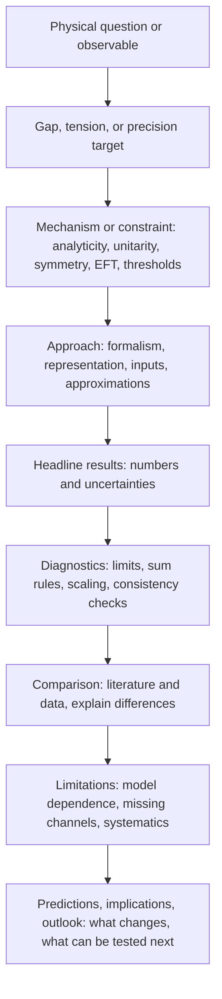

# Physics discussion logic playbook (from exemplar papers)

This playbook captures **general, reusable logic** for discussing physics problems at a high level of rigor and clarity. It is distilled from:
- the user’s existing manuscripts (see `assets/style/style_profile.md`), and
- close reading of exemplar PRL papers across multiple hep-ph author clusters (e.g. Guo / Meißner / Hoferichter collaborations and adjacent work; and Ji / Zhu / Yuan / Zhou / Pospelov PRLs with hep-ph filter).

It is **not** about superficial PRL formatting; it is about how strong papers *reason*, *argue*, and *diagnose*.

Current exemplar-corpus totals used for the “high-yield patterns” section:
- N=50 PRL set (Guo / Meißner / Hoferichter query; dual-model maps), and
- N=96 PRL hep-ph set (Ji / Zhu / Yuan / Zhou / Pospelov query; dual-model maps),
for a combined N=146 (details + paths in `assets/style/style_sources_used.md`).

## A. The core argument loop (mind-map template)

Use this as the default “story graph” for Introduction → Results → Discussion.

## B. What “good physics discussion” does (checklist)

1) **Defines what is being computed/claimed** in operational terms (what observable? what convention? what kinematics?).
2) **Names the controlling physics** (the mechanism) before details: which principle/feature makes the effect large/small?
3) **Separates ingredients from assumptions**: what is input (data, LECs, lattice) vs. what is modeled.
4) **Turns numbers into meaning**: after the number, explain the sign/size/parametric origin and what it implies physically.
5) **Diagnoses uncertainty** with a *hierarchy*: dominant sources, why they dominate, and what would reduce them.
6) **Explains disagreements** by isolating missing ingredients/assumptions (not by authority): “the difference comes from X”.
7) **Ends with actionability**: what measurement/computation would most efficiently validate or falsify the mechanism?

## C. A practical paragraph pattern for Discussion

When writing a Discussion subsection, default to this 5-move sequence:

1) **Bottom line (one sentence)**: restate the main result in words + number (if appropriate).
2) **Mechanism (1–3 sentences)**: why the result has this sign/size; what dominates.
3) **Robustness (1 paragraph)**: key diagnostics and stability checks; what was varied and what moved.
4) **Context (1 paragraph)**: comparison to prior work/data; attribute differences to specific ingredients.
5) **Limitations + next tests (2–5 sentences)**: what remains unverified; a validation plan + kill criterion.

## D. “UNVERIFIED” protocol (for real-research realism)

If a literature claim is needed for core reasoning but you did not independently validate it, mark it explicitly:

- `UNVERIFIED: <claim>`
- **Validation plan**: what to compute/check (derivation, limit, reproduction, alternative method).
- **Kill criterion**: what outcome would invalidate the claim for this project.

This keeps the narrative honest and makes it easy to prioritize follow-up work.

## E. Example: minimal argument map (illustrative)

Example (muon $g-2$ electroweak / dispersive-style papers):

- **Question**: reach sub-$10^{-10}$ precision for a Standard-Model contribution needed to match upcoming experimental accuracy.
- **Gap**: dominant uncertainty traced to a specific hadronic correlator/input (and/or a mismatch among evaluations).
- **Mechanism/constraint**: use dispersive reconstruction / OPE matching / EFT constraints to control systematics.
- **Approach**: update inputs and representations; separate kinematic regions; propagate uncertainties by controlled variations.
- **Result**: quote the headline number with a clear uncertainty; attribute shifts to identifiable improvements.
- **Diagnostics**: show stability under matching-scale variations and explicit cross-checks (limits, sum rules, overlaps).
- **Implications**: identify which uncertainty is now limiting and what would reduce it next.

## F. Corpus → mind-map workflow (for agent swarms)

When you have a local LaTeX corpus (e.g., from `scripts/bin/fetch_prl_style_corpus.py`), you can extract per-paper mind maps and then distill common patterns:

0) (Recommended) Generate per-paper reading packs (N=10 by default) with masking to focus on logic: `scripts/bin/research_writer_learn_discussion_logic.py`.
1) Pick the main TeX file (the one with `\documentclass` and `\begin{document}`).
2) Read (at minimum): Abstract, Introduction opening, “Bottom line/Conclusions”, and the main diagnostics/uncertainty passage(s).
3) Produce a **paper argument map** in a strict, reusable format (Mermaid + bullets).
4) Merge across papers: keep only patterns that recur and remain mechanism-first.

### Prompt template (copy/paste)

**Task**: Build an argument mind map for the provided paper text. Do not copy phrases verbatim unless they are short technical terms. Cite evidence by section name or nearby heading (not line numbers).

**Output format**:

1) `## Argument Map (Mermaid)` → a single `flowchart TD` graph
2) `## Moves (Bullets)` → 8–12 bullets, each of the form: `MOVE: <what it does> | Evidence: <section/heading>`
3) `## Diagnostics & Uncertainties` → 5–8 bullets
4) `## Reusable General Lessons` → 5–10 bullets (generalize; no domain-specific details)

## G. High-yield patterns observed in exemplar papers (N=146)

These are general “moves” that repeatedly appear in strong papers across subfields.

### G1) Precision-target hook (“why now?”)

- Start with the **precision target** (experimental or phenomenological) and state the **gap**: what is currently limiting and why it matters.
- Immediately name the **dominant obstacle** (a correlator, a systematic, an analytic structure, a model dependence) rather than “we compute X”.

### G2) Method transfer with validation

- If you import a technique/constraint from an adjacent problem, explicitly **validate transfer**: reproduce a known benchmark/limit first, then extend.
- When adapting a method to a less-controlled sector, label what becomes **newly model-dependent** and how you bound it.

### G3) Decompose by regimes; use matching as a diagnostic

- Break the problem into **natural regimes/components** (low/high energy, heavy/light degrees of freedom, tensor structures).
- Make the **matching prescription** explicit (scales/overlaps) and use the matching region as a **self-consistency check** for missing contributions.
- For any renormalized quantity, make **scheme/scale conventions** explicit and treat residual dependence (or cancellation) as part of the diagnostic. *(Especially common/explicit in hep-ph; still broadly good practice.)*

### G4) Robustness via “variation + control/baseline”

- Prefer a small set of **targeted variations** that diagnose distinct systematics (matching scale, input model family, fit window, kinematics).
- When possible, add a **baseline/control** that “turns off” the key mechanism, or a **counterfactual** run that isolates which variable drives the trend.

### G5) Shift attribution + uncertainty hierarchy

- If your headline number shifts relative to prior work, **attribute the shift** to a short list of identifiable improvements (what changed and why).
- State the **dominant uncertainty now** (after improvements) and what would reduce it most efficiently.

### G6) Separate “data” from “extraction”

- When results disagree across determinations, distinguish **raw measurements** from **model-dependent extractions** and target the critique at the extraction assumptions.

### G7) Intuition-first mechanism paragraph

- Before showing the key plot/table, give a short **mechanism paragraph**: a physical picture (geometry/threshold/singularity) that predicts the sign/trend the figure will show.

### G8) Future-proofing (honest limitations)

- Name missing effects that are known to exist; explain why they are **subleading for the present claim**, and specify the **next validation step**.
- If anything is not independently validated, use the `UNVERIFIED` protocol (plan + kill criterion).

### G9) Error budget as narrative backbone (not a footnote)

- Present (or at least describe) a **structured error budget**: list sources, relative sizes, and how each is estimated.
- Turn the error budget into **prioritization**: “the dominant uncertainty is X because Y; the next most efficient improvement is Z.”

### G10) Sensitivity-driven “what matters” discussion

- Explicitly connect the headline result to its **most sensitive inputs/assumptions** (fit window, priors, cutoffs, kinematic region, model family).
- Use that sensitivity to justify which new datum/computation would be **highest leverage** (not just “more work is needed”).

### G11) Triangulation: independent routes to the same quantity

- Where possible, compute/estimate the same target via **two conceptually different routes** (representations, parametrizations, datasets, matching schemes).
- Treat the spread as an **honest systematic** (and explain which ingredient causes it), rather than hiding it in a single “preferred” setup.

### G12) Global consistency as a check (multi-observable logic)

- When multiple observables/constraints enter, show that the preferred solution is **globally consistent** (not tuned to one channel).
- If tensions remain, localize them: identify which subset drives the mismatch and what missing ingredient could reconcile it.

### G13) Inference hygiene: stability under fit/prior/cut choices

- Report stability under **fit range/window variations**, alternative priors/regularizations, and cutoffs/matching choices.
- Convert “reasonable variation” into a quantified systematic, and explain why the variation set is **diagnostic** (not arbitrary).

## H. Reusable templates (drafting aids)

### H1) “Bottom line” paragraph (results + attribution + uncertainty)

Use this structure (fill placeholders; do not copy any source phrasing):

- **Bottom line**: “We obtain `<headline observable>` = `<number>` (…); this is `<direction>` relative to `<baseline/prior>`.”
- **Attribution**: “The change is driven by (i) `<ingredient A>`, (ii) `<ingredient B>`, … (sign/direction, not a literature debate).”
- **Dominant uncertainty**: “At this point, the dominant uncertainty arises from `<source>`, because `<reason>`; reducing it requires `<next computation/measurement>`.”

### H2) Robustness paragraph (diagnostics)

- “We test robustness by varying `<knob>` within `<range>`; the result changes by `<Δ>` and we assign `<systematic>` accordingly.”
- “A control/baseline setup `<baseline>` isolates `<mechanism>` by holding `<confounder>` fixed.”

### H3) Error budget paragraph (hierarchy + actionability)

- “Our uncertainty budget is dominated by `<source 1>` (estimated via `<procedure>`), followed by `<source 2>` (estimated via `<procedure>`); other effects are subleading at the present precision.”
- “Reducing `<source 1>` requires `<specific measurement/computation>`; improvements to `<source 2>` would have limited impact until `<source 1>` is addressed.”
